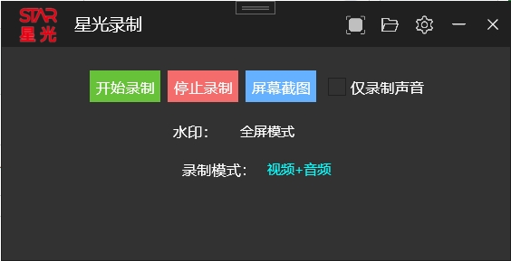

# 星光录制
星光录制，音视频制作好帮手。

## 快捷键
1. Ctrl + Alt + 1 开始录屏  
2. Ctrl + Alt + Q 结束录屏  
3. Ctrl + Alt + A 截图工具  
4. Ctrl + Alt + 2 录屏区域选择(只录制部分区域)  

## 应用场景
1. 远程会议录制  
2. 录音场景  
3. 录制短视频  

## 录制模式
1. 仅录制视频（默认）：只录制视频，不录制声音  
2. 仅录制音频：录音功能，会录制麦克风和扬声器的音频  
3. 视频+音频：录制视频和音频，音频包括麦克风及扬声器  
4. 视频+扬声器：录制视频和扬声器的音频，不录制麦克风的音频  

## 版本记录
不定期发版，请更新软件到最新版本号，如发现有Bug，欢迎提issue。

### V1.2 版本
1. 修复截图Crash的Bug  
2. 增加录制定时结束的功能  
3. 增加录制模的选择功能  

### V1.1.4 版本
1. 可录制视频，音频（麦克风+扬声器）  
2. 可仅录制声音  
3. 录制后对视频进行压缩  
4. 区域录制功能：可选择部分屏幕区域进行录制  
5. 录制中状态，在任务栏里显示闪烁状态  
6. 默认快捷键  
7. 点x关闭后收进托盘  
